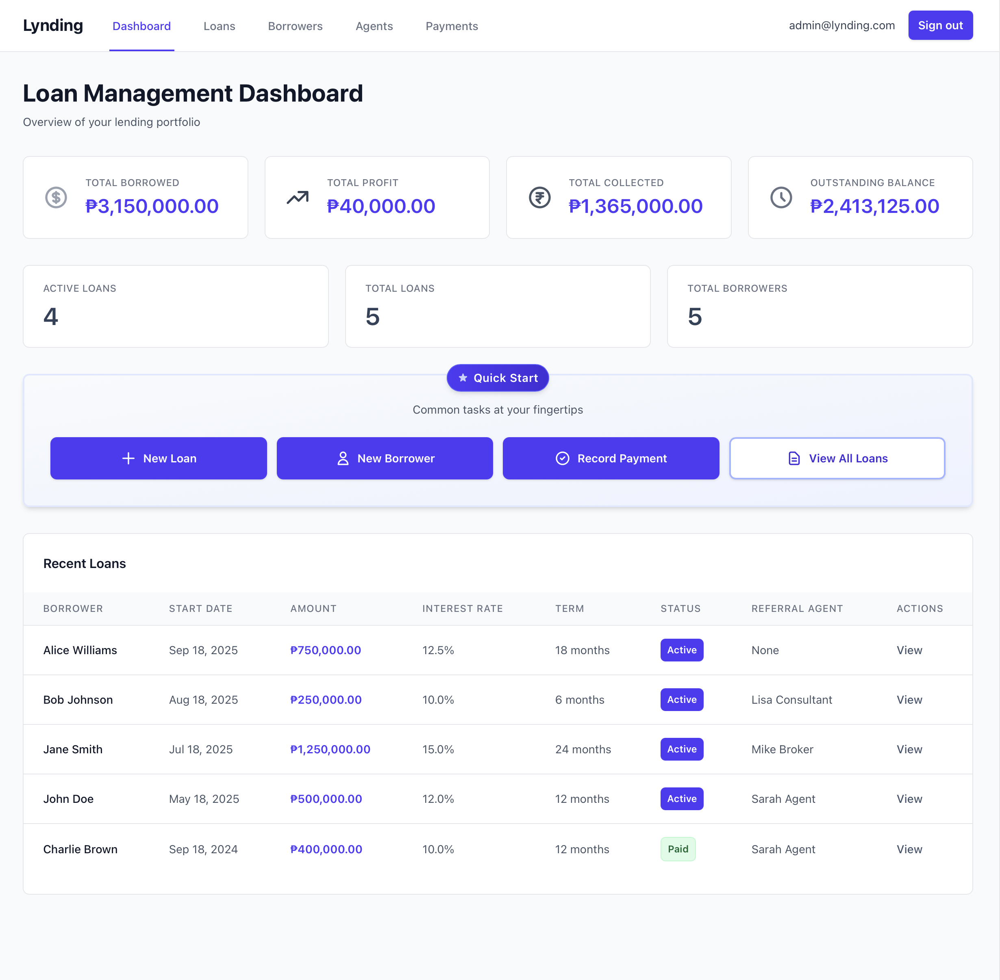
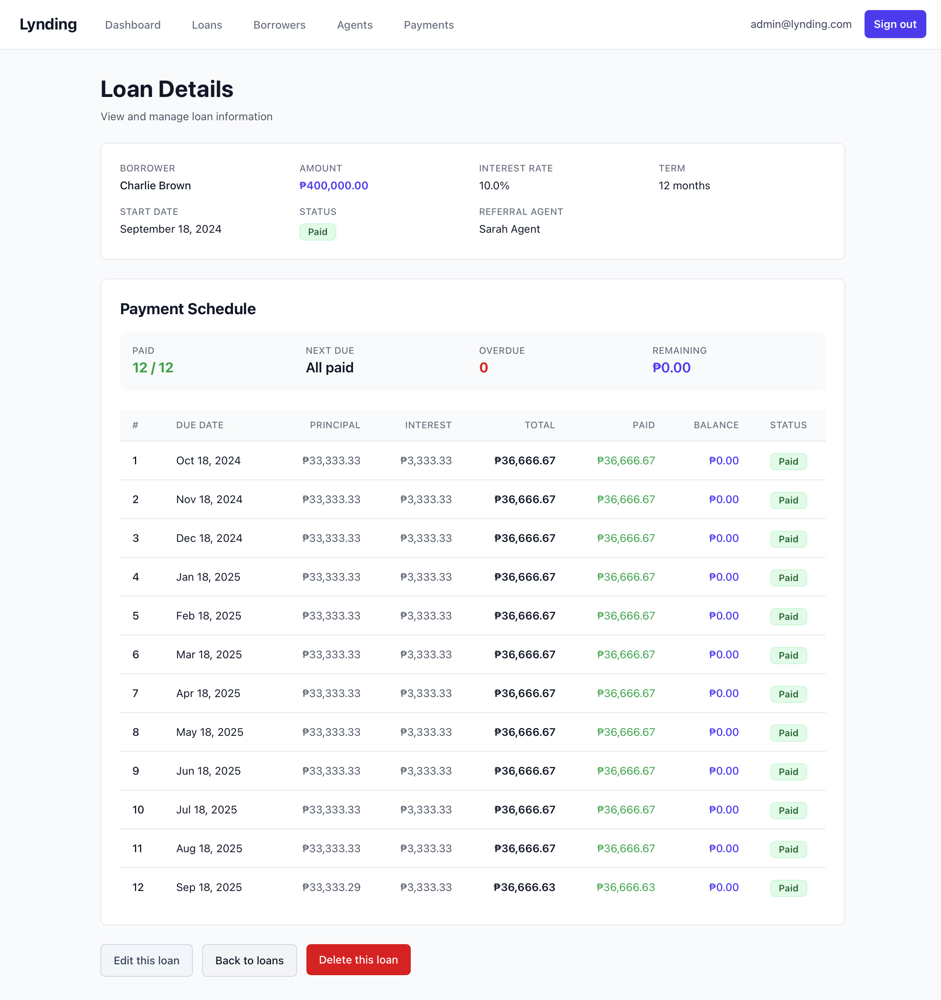

# Lynding - Loan Management System

A comprehensive loan management system built with Ruby on Rails for managing borrowers, loans, payments, and referral agents. Designed specifically for lending companies and microfinance institutions operating in the Philippines.


*Main dashboard showing key metrics and recent loan activity*


*Loan details page with installment schedule and payment tracking*

## Overview

Lynding provides a complete solution for managing the entire loan lifecycle, from borrower registration to payment tracking and installment management. The system automatically generates payment schedules, tracks payment history, and provides real-time insights into loan portfolios.

## Key Features

### 📊 Dashboard & Analytics
- Real-time metrics for total borrowed, profit, and collections
- Outstanding balance tracking
- Active loan monitoring
- Recent loans overview with start dates

### 👥 Borrower Management
- Complete borrower profiles with contact information
- Loan history per borrower
- Data protection: Borrowers with existing loans cannot be deleted

### 💰 Loan Management
- Flexible loan terms with customizable interest rates
- Automatic installment schedule generation
- Loan status tracking (Active, Paid, Defaulted)
- Balance and profit calculations
- Data integrity: Loans with payment history are protected from deletion

### 💳 Payment Processing
- Easy payment recording and tracking
- Automatic payment application to installments
- Payment history preservation for accounting compliance
- Installment status updates (Pending, Partial, Paid, Overdue)
- Immutable payment records for audit trail

### 🤝 Referral Agent Management
- Agent commission rate tracking
- Loan assignment to referral agents
- Safe deletion that preserves loan history

### 📅 Installment Tracking
- Automated monthly installment generation
- Principal and interest breakdown
- Due date monitoring
- Overdue installment identification
- Payment application tracking

## Technical Stack

- **Framework:** Ruby on Rails 8.0
- **Database:** SQLite (development), PostgreSQL-ready for production
- **Frontend:** Tailwind CSS for modern, responsive UI
- **Authentication:** Custom session-based authentication
- **Pagination:** Kaminari with custom Tailwind styling
- **Testing:** RSpec with comprehensive test coverage (186 specs)

## Data Protection Features

The system implements industry-standard deletion protection to prevent accidental data loss:

- ✅ **Borrowers** cannot be deleted if they have any loan history
- ✅ **Loans** cannot be deleted if they have payment records
- ✅ **Payments** are immutable and cannot be deleted (accounting integrity)
- ✅ **Referral Agents** can be safely removed (only nullifies loan references)
- ✅ All financial records preserved for audit trails and compliance

## Getting Started

### Prerequisites

- Ruby 3.x
- Rails 8.0
- SQLite3 (development)
- Node.js (for asset compilation)

### Installation

1. Clone the repository:
```bash
git clone <repository-url>
cd lynding_ai
```

2. Install dependencies:
```bash
bundle install
```

3. Setup database:
```bash
rails db:create
rails db:migrate
rails db:seed
```

4. Start the server:
```bash
rails server
```

5. Visit `http://localhost:3000` and sign in with default credentials (created during seed)

### Running Tests

```bash
bundle exec rspec
```

The test suite includes 186 examples covering:
- Model validations and associations
- Business logic calculations
- Payment processing workflows
- Data integrity constraints
- Edge cases and error handling

## Database Schema

### Core Models

- **Borrowers** - Customer information and contact details
- **Loans** - Loan records with amount, interest rate, term, and status
- **Payments** - Payment transactions with automatic installment application
- **Installments** - Auto-generated payment schedules with due dates
- **InstallmentPayments** - Join table tracking payment applications
- **ReferralAgents** - Agent information with commission rates
- **Users** - System users with authentication
- **Sessions** - User session management

### Key Relationships

```
Borrower (1) ──── (N) Loan
Loan (1) ──── (N) Payment
Loan (1) ──── (N) Installment
Payment (N) ──── (N) Installment (through InstallmentPayment)
ReferralAgent (1) ──── (N) Loan
User (1) ──── (N) [Created/Updated records]
```

## Configuration

- Loans are configured for Philippine Peso (PHP) currency
- Interest rates calculated on annual basis
- Installments generated monthly
- Default pagination: 10 records per page

## Deployment

This application is ready for deployment to platforms like:
- Heroku
- Railway
- Fly.io
- Any platform supporting Ruby on Rails

Update the database configuration in `config/database.yml` for production use with PostgreSQL.

## Contributing

This is a private project. For issues or feature requests, please contact the development team.

## License

Proprietary - All rights reserved

## Support

For support, please contact the development team or raise an issue in the project repository.
